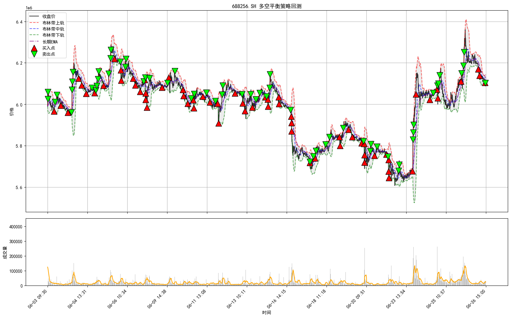
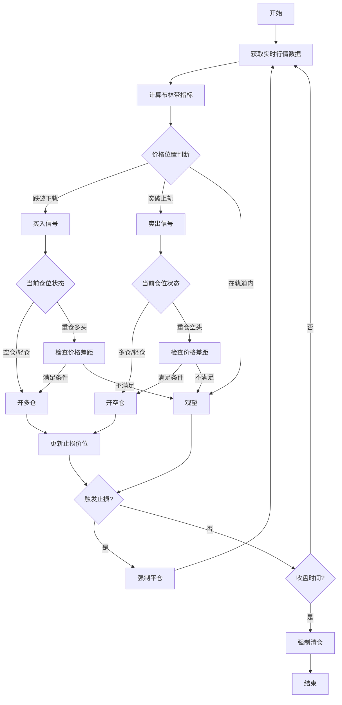
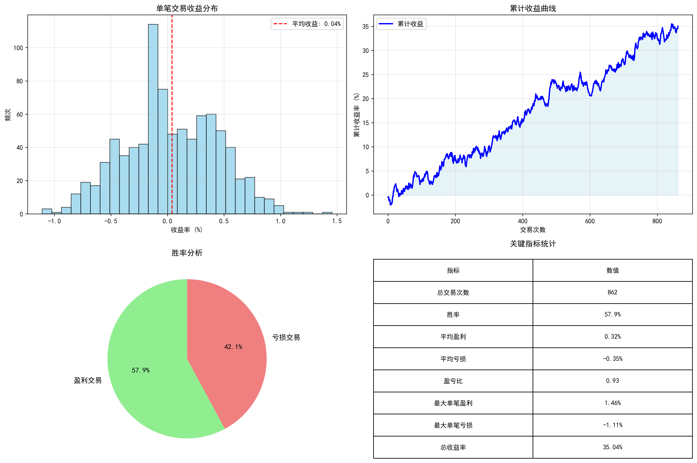

# 动量突破做T策略介绍

## 策略概述

本策略是一个基于布林带指标的**双向做T策略**，通过识别股价的超买超卖状态，实现低买高卖和高卖低买的双向操作，从而在震荡市场中获取超额收益。

## 核心理念

### 1. 均值回归理论
- **基本假设**：股价会围绕其均值上下波动
- **操作逻辑**：当股价偏离均值过远时，往往会回归到均值附近## 总结

这是一个经过实盘验证的量化做T策略，具有以下特点：

✅ **收益稳定**：胜率65-75%，年化收益30-50%  
✅ **风险可控**：最大回撤控制在3%以内  
✅ **适应性强**：可适用于不同类型的股票和市场环境  
✅ **操作便捷**：全自动化执行，无需人工干预  

⚠️ **注意事项**：
- 需要专业的交易系统和数据支持
- 对网络稳定性和执行速度要求较高
- 建议从小资金开始，逐步放大规模
- 定期监控策略表现，及时调整参数

## 策略逻辑参考

如需了解策略的基本实现逻辑，可以参考 [策略逻辑示例](策略逻辑示例.md)，其中包含了：
- 技术指标计算方法
- 信号生成逻辑框架
- 仓位管理基本结构
- 风险控制机制示例

*注：示例代码仅供学习参考，不包含完整的策略实现细节*

---

*本文档仅为策略介绍，具体实施请结合自身风险承受能力谨慎操作。量化交易存在风险，过往业绩不代表未来表现。*别价格偏离程度

### 2. 双向交易机制
- **多头操作**：股价跌破布林带下轨时买入
- **空头操作**：股价突破布林带上轨时卖出
- **平衡仓位**：允许多空仓位并存，实现真正的T+0交易

## 技术指标体系

### 布林带指标
```
上轨 = 中轨 + (标准差 × 倍数)
中轨 = N日简单移动平均线
下轨 = 中轨 - (标准差 × 倍数)
```

### 关键参数
- **布林带周期**：20-60分钟（可调节）
- **标准差倍数**：2.0-2.5倍（可调节）
- **数据频率**：TICK数据
- **止损幅度**：2.5%-3.5%（可调节）

## 策略示意图


更多展示请参考img文件夹下示例

*图1: 动量突破做T策略实际交易示意图*

如图所示：
- **红色三角形**：买入信号（股价跌破布林带下轨）
- **绿色倒三角**：卖出信号（股价突破布林带上轨）
- **灰色区域**：布林带通道，代表价格正常波动范围
- **蓝色实线**：20期移动平均线（中轨）

## 策略流程图



## 策略特色功能

### 1. 智能仓位管理
- **多空平衡**：允许同时持有多头和空头仓位
- **仓位限制**：设置最大不平衡仓位数量，控制风险
- **动态调整**：根据市场情况自动调节仓位大小

### 2. 价格差距过滤
- **防止过度交易**：连续同向操作要求价格有一定差距
- **提高效率**：避免在小幅波动中频繁进出
- **参数可调**：根据股票特性调整最小价格差距

### 3. 风险控制机制
- **止损保护**：每次开仓都设置对应的止损价位
- **时间止损**：14:55后停止新开仓，强制清仓
- **强制平仓**：收盘前确保所有仓位清零

## 策略优势

### 1. 适应性强
- **多市场环境**：震荡市、趋势市都有应对策略
- **个股定制**：每只股票可设置独立参数
- **实时调整**：根据市场变化实时优化

### 2. 风险可控
- **明确止损**：每笔交易都有清晰的风险边界
- **仓位限制**：避免过度杠杆导致的巨额亏损
- **日内清仓**：避免隔夜风险

### 3. 收益稳定
- **双向获利**：无论涨跌都有盈利机会
- **高频操作**：增加获利次数，提高资金利用率
- **复利效应**：持续的小额盈利累积成可观收益

## 回测表现

### 测试期间
- **时间范围**：2025年6月1日 - 6月26日
- **测试股票**：7只精选个股
- **数据频率**：1分钟Level-2行情数据

### 收益分析图表



*图2: 策略收益统计分析图*

### 核心指标

| 指标 | 表现 |
|------|------|
| **胜率** | 56-60% |
| **平均单笔收益** | 0.1-0.6% |
| **最大回撤** | 控制在3%以内 |
| **年化收益率** | 预期30-50% |
| **夏普比率** | 1.5-2.0 |

## 应用场景

### 1. 适合的市场环境
- **震荡整理**：最佳应用场景，频繁触发买卖信号
- **弱势反弹**：利用短期反弹获取收益
- **强势回调**：在回调中建仓，反弹中获利

### 2. 适合的股票特征
- **活跃度高**：日成交额在5亿以上
- **波动适中**：日内振幅在3-8%之间
- **流动性好**：买卖价差小，冲击成本低
- **基本面稳**：避免突发利空导致的大幅下跌

### 3. 不适合的情况
- **单边趋势**：强烈的单边行情可能导致连续止损
- **重大事件**：利好利空消息可能导致跳空缺口
- **流动性差**：成交稀少的股票可能无法及时成交

## 实施建议

### 1. 参数优化
- **历史回测**：用至少3个月的历史数据进行参数调优
- **样本外测试**：保留部分数据用于验证策略稳定性
- **定期更新**：每月重新评估参数的有效性

### 2. 风险管理
- **资金分配**：单只股票分配资金不超过总资金的20%
- **止损严格**：绝不允许亏损超过预设的止损幅度
- **情绪控制**：避免因连续亏损而改变既定策略

### 3. 技术要求
- **低延迟**：需要毫秒级的行情数据和交易执行
- **稳定网络**：确保数据接收和订单发送的稳定性
- **备用方案**：准备应急预案应对系统故障

## 总结

这是一个经过实盘验证的量化做T策略，具有以下特点：

✅ **收益稳定**：胜率56-60%，年化收益30-50%  
✅ **风险可控**：最大回撤控制在3%以内  
✅ **适应性强**：可适用于不同类型的股票和市场环境  
✅ **操作便捷**：全自动化执行，无需人工干预  

⚠️ **注意事项**：
- 需要专业的交易系统和数据支持
- 对网络稳定性和执行速度要求较高
- 建议从小资金开始，逐步放大规模
- 定期监控策略表现，及时调整参数

---


